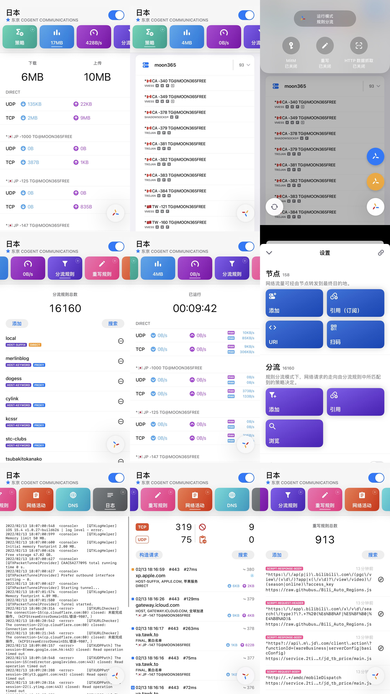
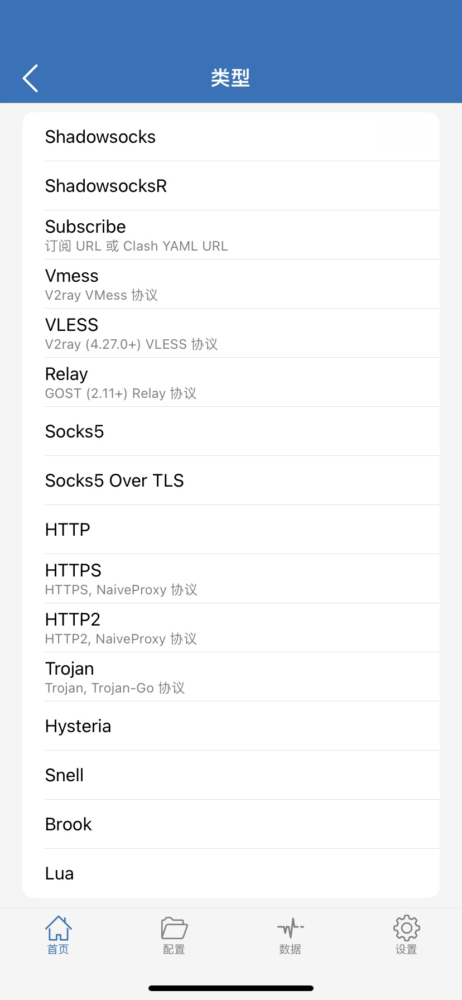

<a rel="license" href="https://creativecommons.org/licenses/by-sa/4.0/deed.zh"></a>
#  Openit
<h6>Powered by <font color="green">OpenPCRS</font></h6>

<div align="center">

[](https://github.com/Acheirial/openit/actions/workflows/Nodes.yaml)
[](./LICENSE)

</div>

**Base64**
```
https://raw.githubusercontent.com/Acheirial/openit/main/long
```

**小火箭**
```
https://raw.githubusercontent.com/Acheirial/openit/main/https
```

**Mihomo (Clash Meta)**
```
https://raw.githubusercontent.com/Acheirial/openit/main/Clash.yaml
```

**Quanx**
```
https://raw.githubusercontent.com/Acheirial/openit/main/Quanx.conf
```

本地文件：`long` / `https` / `Clash.yaml` / `Quanx.conf`。定时更新见 [`.github/workflows/Nodes.yaml`](./.github/workflows/Nodes.yaml)。

**不同订阅之间的区别**

- **Base64**：大多数客户端可导入
- **小火箭**：给 Shadowrocket
- **Mihomo**：给 Clash Meta / Mihomo / Clash Verge Rev。公开文件名仍是 `Clash.yaml`，兼容旧 URL
- **Quanx**：给 Quantumult X

***

客户端请走各项目 GitHub Releases，不要下 2022 年的固定包。Clash 系用 Mihomo，不要再用 Clash Premium / Clash for Windows / ClashX / ClashForAndroid。

## Windows

首推 [v2rayN](https://github.com/2dust/v2rayN/releases) 和 [Clash Verge Rev](https://github.com/clash-verge-rev/clash-verge-rev/releases)（Mihomo 内核）。

- [v2rayN](https://github.com/2dust/v2rayN/releases) — 当前 7.24.8
- [Clash Verge Rev](https://github.com/clash-verge-rev/clash-verge-rev/releases) — 当前 v2.5.2
- [Mihomo](https://github.com/MetaCubeX/mihomo/releases) — 当前 v1.19.30
- [Shadowsocks-Windows](https://github.com/shadowsocks/shadowsocks-windows/releases) — 仅 ss
- [ShadowsocksR-Windows](https://github.com/shadowsocksrr/shadowsocksr-csharp/releases) — 仅 ssr，停更

`.7z` 可用 [Bandizip](https://www.bandisoft.com/bandizip/)。

## macOS

Clash 系用 Mihomo / Clash Verge Rev。ClashX 已停更。Apple Silicon 也可用 Shadowrocket、Quantumult X。

- [Clash Verge Rev](https://github.com/clash-verge-rev/clash-verge-rev/releases)
- [Mihomo](https://github.com/MetaCubeX/mihomo/releases)
- [v2rayN](https://github.com/2dust/v2rayN/releases)
- [v2rayA](https://github.com/v2rayA/v2rayA/releases)
- [ShadowsocksX-NG](https://github.com/shadowsocks/ShadowsocksX-NG/releases)
- [Surge](https://nssurge.com/)
- [Shadowrocket](https://apps.apple.com/app/shadowrocket/id932747118) *$2.99*
- [Quantumult X](https://apps.apple.com/app/quantumult-x/id1443988620) *$7.99*
- [Surge](https://apps.apple.com/app/surge-4/id1442620678) *$49.99* App 内购买

`.7z` 用系统解压或 [The Unarchiver](https://apps.apple.com/app/the-unarchiver/id425424353)。Gatekeeper 提示见 [Apple 说明](https://support.apple.com/zh-cn/guide/mac-help/mh40620/mac)。

## Android

Clash 系用 [ClashMetaForAndroid](https://github.com/MetaCubeX/ClashMetaForAndroid/releases)（当前 v2.11.33）。ClashForAndroid Premium 已停更。

- [ClashMetaForAndroid](https://github.com/MetaCubeX/ClashMetaForAndroid/releases)
- [v2rayNG](https://github.com/2dust/v2rayNG/releases) — 当前 2.2.6
- [NekoBox / SagerNet](https://github.com/MatsuriDayo/NekoBoxForAndroid/releases)
- [Shadowsocks](https://github.com/shadowsocks/shadowsocks-android/releases)
- [Surfboard](https://github.com/getsurfboard/surfboard/releases)

Google Play 有上架的也可直接搜包名。不要走失效的 ghproxy / APKPure 镜像。

## iOS

首推 Shadowrocket。Quantumult X、Surge、Stash 面向分流/MitM。Stash 吃 Clash/Mihomo 规则，本仓库 `Clash.yaml` 按 Mihomo Meta 生成。付费 App 需外区 Apple ID。

- [Shadowrocket](https://apps.apple.com/app/shadowrocket/id932747118) *$2.99*
- [Quantumult X](https://apps.apple.com/app/quantumult-x/id1443988620) *$7.99*
- [Surge](https://apps.apple.com/app/surge-4/id1442620678) *$49.99*
- [Stash](https://apps.apple.com/app/stash/id1596063349) *$2.99*
- [Loon](https://apps.apple.com/app/loon/id1373567447) *$4.99*
- [Quantumult](https://apps.apple.com/app/quantumult/id1252015438) *$4.99* — 2020 年后基本停更
- [OneClick](https://apps.apple.com/app/oneclick-safe-easy-fast/id1545555197) *Free*

圈 X 规则可参考 [blackmatrix7/ios_rule_script](https://github.com/blackmatrix7/ios_rule_script)。

## Linux

- [Clash Verge Rev](https://github.com/clash-verge-rev/clash-verge-rev/releases)
- [Mihomo](https://github.com/MetaCubeX/mihomo/releases)
- [v2rayN](https://github.com/2dust/v2rayN/releases)
- [v2rayA](https://github.com/v2rayA/v2rayA/releases) — 当前 v2.4.16

内核：

- [Mihomo](https://github.com/MetaCubeX/mihomo/releases) — 当前 v1.19.30
- [Xray-core](https://github.com/XTLS/Xray-core/releases) — 当前 v26.3.27
- [v2ray-core](https://github.com/v2fly/v2ray-core/releases) — 当前 v5.53.0

Dreamacro Clash Premium 已停更，不要再下。

## Android TV

解码强、协议栈弱。建议软路由做协议转换，电视只连局域网。SS TV 包见 [shadowsocks-android](https://github.com/shadowsocks/shadowsocks-android/releases)。

***

# Dockerfile

ClashCheck 容器。先改 [`utils/clashcheck/config/config.yaml`](./utils/clashcheck/config/config.yaml) 的 `source:`（默认本仓库节点池产物）。

```
git clone https://github.com/Acheirial/openit.git --single-branch --depth=1
docker build -t clashcheck openit/utils/clashcheck
docker run -d --restart=on-failure:3 -p 80:80 clashcheck
```

端口占用把左边改成宿主机端口。等 1–2 分钟访问 `http://127.0.0.1:<port>` 看 `check.yaml`。测活只在 CI 或你明确要求的环境跑，不要对本机扫节点。

# 声明

本仓库采用 CC BY-SA 4.0。

OpenPCRS = ProxyPool + ClashCheck + Remove&Rename + Subconverter。

- 收集：[`utils/pool/main.py`](./utils/pool/main.py)，源自 [daycat/pyray](https://github.com/daycat/pyray)
- 测活：[`utils/clashcheck/main.py`](./utils/clashcheck/main.py)，源自 [daycat/clashcheck](https://github.com/daycat/clashcheck)
- 去重重命名：[`utils/rm/index.js`](./utils/rm/index.js)
- 转换：[`utils/subconverter`](./utils/subconverter)，源自 [tindy2013/subconverter](https://github.com/tindy2013/subconverter)，本仓库用 Mihomo 解析桥
- 流水线：[`.github/workflows/Nodes.yaml`](./.github/workflows/Nodes.yaml)

节点列表：[`url`](./url)

`Clash.yaml` 规则：[`utils/subconverter/config/rule.ini`](./utils/subconverter/config/rule.ini)

`Quanx.conf` 引用神机、[blackmatrix7/ios_rule_script](https://github.com/blackmatrix7/ios_rule_script)、[lhie1](https://github.com/lhie1)、[KOP-XIAO/QuantumultX](https://github.com/KOP-XIAO/QuantumultX)、MaxMind、[Mazeorz/iOS_Rules_Scripts](https://github.com/Mazeorz/iOS_Rules_Scripts)、[GeQ1an/Rules](https://github.com/GeQ1an/Rules)、[Koolson/Qure](https://github.com/Koolson/Qure)。

节点来自互联网公开源，非盈利，仅供交流学习，订阅后 24 小时内删除。出现问题作者不负责。

本仓库由 [yu-steven/openit](https://github.com/yu-steven/openit) 演进，当前维护 [Acheirial/openit](https://github.com/Acheirial/openit)。

# Time in Stars

[](https://starchart.cc/Acheirial/openit)

#### Quantumult X UI

[](https://apps.apple.com/app/quantumult-x/id1443988620)

#### Shadowrocket 协议

[](https://apps.apple.com/app/shadowrocket/id932747118)
